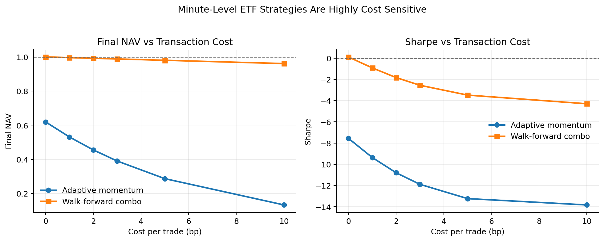
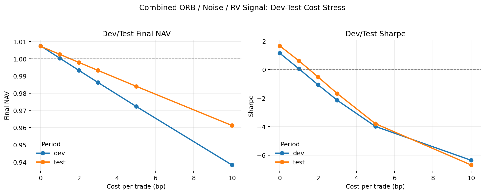
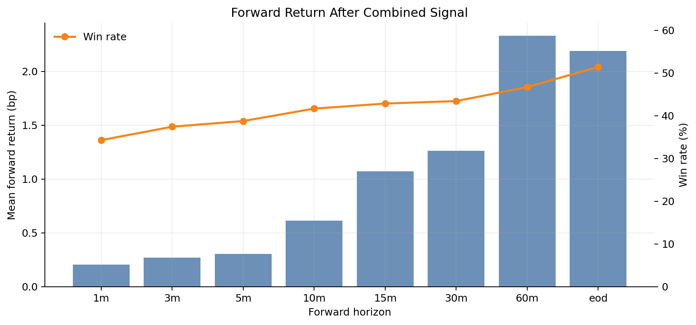
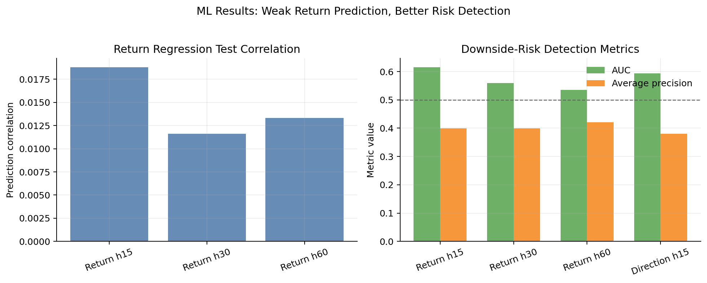
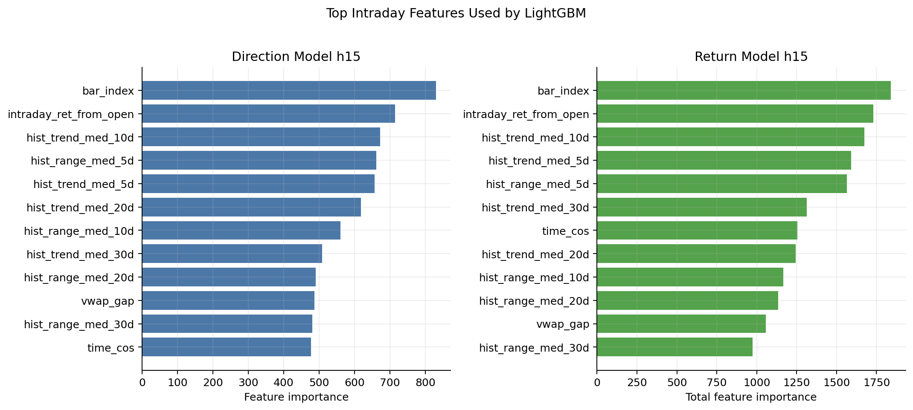

# A 股 T+0 ETF 分钟级日内信号研究

本项目基于 2022—2024 年 A 股 T+0 ETF 1 分钟 OHLCV 行情数据，构建了一个从数据下载、分钟级面板构建、数据质量审计、规则信号、机器学习预测、交易成本敏感性分析到 walk-forward 样本外验证的完整量化研究框架。

项目的核心问题不是简单寻找一个回测收益较高的策略，而是系统检验：

> 在仅使用 1 分钟 bar 数据的条件下，A 股 T+0 ETF 的短周期收益是否具有稳定可交易性？
> 如果策略表现不佳，主要约束来自信号本身、交易成本、样本池限制，还是数据粒度不足？

最终结果表明：在当前数据条件和交易结构下，A 股 T+0 ETF 的分钟级正收益预测难度较高。组合信号在零成本假设下存在有限边际，但加入交易成本后收益迅速衰减；机器学习模型对下行风险的识别相对更稳定，但不足以直接转化为稳定的开仓收益。因此，本项目更适合定位为 **A 股 T+0 ETF 分钟级信号有效性检验与交易成本敏感性研究**，而不是可直接部署的实盘交易系统。

---

## 1. 项目背景

A 股市场中，只有部分 ETF 支持 T+0 交易。相比普通 T+1 股票或 ETF，T+0 ETF 理论上更适合进行日内交易和短周期信号研究。

但是，分钟级 ETF 策略并不天然容易成立。原因包括：

- A 股 T+0 ETF 数量有限，横截面样本远小于股票市场；
- ETF 本身波动率通常低于个股，短周期收益空间较薄；
- 1 分钟 OHLCV 数据只包含开高低收、成交量和成交额，缺少盘口、逐笔成交、主动买卖方向等微观结构信息；
- 分钟级策略对交易成本、买卖价差、滑点和冲击成本极其敏感；
- 简单的日内动量或突破信号容易被短周期噪声淹没；
- long-only 结构难以直接利用负向信号获利。

因此，本项目并不预设"分钟级 ETF 策略一定有效"，而是通过完整实验链条检验它到底是否具有可交易性。

---

## 2. 研究问题

项目围绕以下问题展开：

1. **数据层面** — 1 分钟 OHLCV 数据是否足以支持 ETF 短周期收益预测？
2. **规则信号层面** — 日内动量、开盘区间突破、噪声过滤、realized volatility、相对强弱等信号是否具有稳定边际？
3. **机器学习层面** — LightGBM 是否能够从分钟级特征中学习到未来 15/30/60 分钟收益信息？
4. **风险识别层面** — 相比预测正收益，模型是否更擅长识别未来下行风险？
5. **交易成本层面** — 交易成本是否会直接决定分钟级策略是否可交易？
6. **样本外稳定性层面** — 在 walk-forward 滚动验证下，策略是否仍然稳定？

---

## 3. 数据说明

### 3.1 数据来源

数据来源为 Tushare Pro API，主要使用 A 股 ETF 1 分钟行情数据。

原始行情数据未随仓库公开，主要原因包括：

- 数据接口需要 Tushare Pro 权限；
- 原始分钟级行情体积较大；
- 行情数据存在版权和再分发限制；
- 本仓库重点展示研究框架、代码结构、实验结果和分析报告。

### 3.2 样本范围

```text
样本区间：2022-01-01 至 2024-12-31
数据频率：1 分钟 bar
研究对象：A 股 T+0 ETF（23 只，含 7 只商品 ETF + 16 只跨境 ETF）
主要字段：open, high, low, close, volume, amount
面板规模：~397 万行 × 69 列特征
交易天数：726 天
```

### 3.3 ETF 标的池

研究对象主要包括具备 T+0 交易属性的 ETF 类型：

- 商品 ETF（黄金、豆粕、有色、能源化工等）；
- 跨境 ETF；
- 债券 ETF；
- 货币 ETF。

项目不使用普通 T+1 ETF 构建日内交易策略，以避免交易制度与回测假设不一致。

---

## 4. 整体研究流程

项目按照完整量化研究流程展开，而不是只进行单一模型回测。

```text
T+0 ETF 1 分钟原始行情
        ↓
数据清洗与质量审计
        ↓
分钟级研究面板构建
        ↓
日内特征工程
        ↓
规则信号策略测试
        ↓
组合信号策略测试
        ↓
机器学习预测模型
        ↓
交易成本敏感性分析
        ↓
walk-forward 样本外验证
        ↓
最终结论与局限性分析
```

该流程的重点在于：

- 先验证数据质量，再进行回测；
- 先构建简单规则基准，再使用机器学习模型；
- 先看零成本信号边际，再加入交易成本；
- 先做开发期测试，再做 walk-forward 样本外验证；
- 对无效或较弱结果进行解释，而不是只展示最好看的回测曲线。

---

## 5. 研究尝试与模型设计

本项目并没有只测试单一策略，而是从简单规则到机器学习逐步推进。

### 5.1 规则策略：自适应日内动量

首先构建自适应日内动量策略，用于检验 ETF 分钟级收益是否存在短周期趋势延续。

该策略综合考虑：

- 日内动量；
- 波动率状态；
- 流动性状态；
- 交易成本；
- 不同 ETF 类型。

该部分的意义在于建立基础规则策略基准。如果简单动量策略完全无效，后续复杂模型需要证明自己能够显著改善该基准。

### 5.2 组合信号：ORB + Noise + RV + Relative Value

在单一动量信号基础上，进一步构建组合信号框架，包括：

1. **开盘区间突破信号** — Opening Range Breakout，检验开盘阶段价格方向是否具有后续延续性。
2. **噪声过滤信号** — 使用短周期波动和噪声指标过滤低质量交易环境。
3. **Realized Volatility 信号** — 描述日内风险状态，识别高波动下信号可能失效的情形。
4. **相对强弱信号** — 利用 ETF 横截面排序，检验同一交易时点不同 ETF 之间是否存在相对机会。

该部分试图回答的问题是：如果单一信号较弱，多个弱信号组合后是否能够形成更稳定的交易边际？

### 5.3 方向分类模型

使用 LightGBM Classifier 预测未来收益方向。

```text
模型：LightGBM Classifier
目标：预测未来收益是否为正
预测周期：15 分钟
```

该模型用于检验分钟级特征是否具备基本方向识别能力。

### 5.4 收益回归模型

使用 LightGBM Regressor 直接预测未来收益率。

```text
模型：LightGBM Regressor
目标：预测未来收益率
预测周期：15 分钟 / 30 分钟 / 60 分钟
```

该模型是更直接的收益预测尝试。但实验结果显示，收益回归模型的预测相关性较低，说明直接预测短周期正收益非常困难。

### 5.5 下行风险分类模型

使用 LightGBM Classifier 识别未来是否可能出现较大负收益。

```text
模型：LightGBM Classifier
目标：识别未来下行风险事件
预测周期：15 分钟 / 30 分钟 / 60 分钟
```

该部分的结果相对更有信息量。相比直接预测正收益，模型对下行风险的识别更稳定，说明 1 分钟 OHLCV 特征更适合判断"不适合交易的环境"，而不是直接判断"应该买入的机会"。

---

## 6. 核心实验结论

### 6.1 短周期正收益预测能力较弱

收益回归模型在测试集上的预测相关性较低。

```text
收益回归预测相关性 pred_ret_corr：约 0.019
方向分类 AUC：约 0.594
```

这说明，仅依赖 1 分钟 OHLCV 特征，很难稳定预测未来 15/30/60 分钟正收益。这一结果并不表示数据完全没有信息，而是说明：可预测信号较弱，信号边际不足，难以覆盖真实交易成本，很难直接转化为稳定开仓策略。

### 6.2 下行风险识别相对更稳定

相比收益回归，下行风险分类模型表现更稳定。

```text
下行风险分类 AUC：约 0.616
Average Precision：约 0.400
```

这表明分钟级 OHLCV 数据对"不利交易环境"的识别能力强于对"正收益机会"的识别能力。模型更适合用于：过滤高风险交易时段、避免进入不利市场状态、辅助风控、作为交易信号的风险过滤器。但它还不足以单独构成稳定盈利的开仓策略。

### 6.3 交易成本显著侵蚀策略收益

组合信号在零成本假设下存在一定边际，但加入交易成本后收益迅速衰减。

**组合信号（commodity_focus）结果：**

| 期间 | 成本 | 交易数 | Final NAV | Sharpe | 胜率 |
|---|---|---|---|---|---|
| 开发期 (2022-2023) | 0bp | 178 | 1.0075 | 1.15 | 41.0% |
| 开发期 (2022-2023) | 2bp | 178 | 0.9933 | -1.06 | 33.7% |
| 测试期 (2024) | 0bp | 117 | 1.0073 | 1.67 | 48.7% |
| 测试期 (2024) | 2bp | 117 | 0.9979 | -0.51 | 41.0% |

**Walk-forward 逐日回测：**

| 成本 | 交易数 | Final NAV | Sharpe | 胜率 |
|---|---|---|---|---|
| 0bp | 99 | 1.0004 | 0.11 | 39.4% |
| 2bp | 99 | 0.9925 | -1.83 | 25.3% |

**自适应动量：**

| 成本 | 交易数 | Final NAV | 年化收益 | Sharpe | 最大回撤 |
|---|---|---|---|---|---|
| 0bp | 3,517 | 0.619 | -15.3% | -7.55 | -38.1% |
| 2bp | 3,517 | 0.455 | -23.9% | -10.80 | -54.5% |

零成本下有微弱正收益，2bp 成本后即转负。单笔预测收益太薄，交易成本、滑点、买卖价差和冲击成本会直接吞噬信号边际。

### 6.4 Walk-forward 验证显示信号稳定性不足

项目使用 walk-forward 方法进行滚动样本外验证，以降低过拟合风险。结果显示：部分信号在开发期存在一定表现，但滚动样本外表现不稳定，参数和信号组合难以长期保持优势，开发期最优结果不能直接代表未来可交易表现。

---

## 7. 为什么收益表现较差

本项目的收益表现不理想，但这不是单一原因造成的，而是多个约束共同作用的结果。

### 7.1 1 分钟 OHLCV 数据信息不足

1 分钟 bar 只包含 open, high, low, close, volume, amount，但真正影响分钟级交易质量的很多信息并不存在，例如：买一卖一价差、盘口深度、委托队列变化、主动买入和主动卖出、大单冲击、成交方向、撤单行为、瞬时流动性变化。

对于日频策略，OHLCV 可能已经足够构建基础信号；但对于分钟级交易，缺少微观结构信息会严重限制预测能力。

### 7.2 ETF 分钟级收益空间本身较薄

ETF 是一篮子资产的组合，波动率通常低于个股。在 15/30/60 分钟尺度下，很多 ETF 的收益变化幅度非常小。面板中 15min forward return 的均值约 -0.12bp，随机买入持有 15 分钟，平均就是微亏的。这意味着即使方向判断略有优势，单笔收益也可能不足以覆盖交易成本。

### 7.3 A 股 T+0 ETF 样本池较小

A 股可 T+0 交易的 ETF 只有 23 只，商品子集仅 7 只。机器学习模型通常需要大量横截面样本和稳定的特征差异，但 ETF 横截面排序空间不足，模型可学习样本有限，标的之间差异不够丰富，单一市场状态对整体样本影响较大。

### 7.4 交易成本对分钟级策略影响过大

最好的策略（组合信号）平均每笔毛收益 0.31bp，而 A 股 ETF 单边交易成本至少 1-2bp。每笔交易的净收益 = 0.31bp - 2bp = -1.69bp。信号产生的边际比交易门槛还低。分钟级策略的持仓周期短，换手频率高，一旦加入交易成本，很多零成本下看似存在的微弱收益会迅速消失。

### 7.5 Long-only 结构限制了负向信号利用

实验中多数策略采用 long-only 逻辑。模型即使能识别下行风险，也主要只能用于"不买"或"过滤"，而不能直接通过做空获利。下行风险模型虽然表现相对更好，但它的价值更多体现在风险控制、交易过滤、降低错误开仓和辅助仓位管理，在 long-only 约束下不能完全转化为收益来源。

---

## 8. 项目价值

虽然最终没有得到可直接实盘部署的高收益策略，但项目仍然具有明确价值。

### 8.1 完成了完整的量化研究闭环

项目覆盖了：数据获取 → 数据清洗 → 面板构建 → 质量审计 → 特征工程 → 规则策略 → 机器学习模型 → 交易成本分析 → walk-forward 验证 → 结果解释。这比单纯展示一条收益曲线更接近真实量化研究流程。

### 8.2 系统性排除了多种可能性

通过五轮迭代，系统性地排除了多个可能性：

- 单纯动量不行 → V1 证否
- 加过滤和自适应退出也不行 → V2 证否
- 多信号组合在零成本下有效但成本后不行 → V3 证否
- 机器学习直接预测正收益不行 → V4/V5 证否
- 但下行风险识别有微弱信号 → V5 发现

这些结论的"排雷"价值，不亚于找到一个正收益策略。知道什么路走不通，和知道什么路走得通，同样重要。

### 8.3 明确了后续改进方向

实验结果表明，如果要继续提升分钟级 ETF 策略的可交易性，可能需要：

- tick 级成交数据；
- 盘口和订单簿数据；
- 更精细的执行成本模型；
- 更低交易成本的执行环境；
- 更强的流动性过滤；
- 更适合风险过滤而非直接预测收益的策略结构；
- 不同于 simple long-only 的交易设计。

---

## 9. 仓库结构

```text
.
├── README.md
├── requirements.txt
├── config.yaml
├── .gitignore
├── LICENSE
│
├── scripts/
│   ├── download_t0_etf_1min_2022_2024.py
│   ├── build_t0_intraday_bar_panel_2022_2024.py
│   ├── audit_t0_intraday_panel_and_backtest_assumptions.py
│   ├── backtest_adaptive_intraday_momentum.py
│   ├── backtest_combined_orb_noise_rv.py
│   ├── backtest_combo_walk_forward_daily.py
│   ├── diagnose_combo_signal_forward_returns.py
│   ├── train_intraday_lgbm_direction_model.py
│   └── train_intraday_lgbm_return_model.py
│
├── data/
│   ├── README_data.md
│   └── sample_config/
│
├── docs/
│   ├── run_order.md
│   ├── methodology.md
│   ├── limitations.md
│   ├── data_dictionary.md
│   └── experiment_log.md
│
└── reports/
    ├── final_report.md
    ├── panel_audit_report.md
    ├── adaptive_momentum_report.md
    ├── adaptive_momentum_commodity_report.md
    ├── combo_dev_test_report.md
    ├── combo_walk_forward_report.md
    ├── signal_diagnostics_report.md
    ├── ml_direction_h15_report.md
    ├── ml_return_h15_report.md
    ├── ml_return_h30_report.md
    ├── ml_return_h60_report.md
    ├── figures/
    └── tables/
```

本地大数据目录 `data_t0_2022_2024/` 不随仓库提供（已被 `.gitignore` 忽略）。

---

## 10. 运行方式

### 10.1 安装依赖

```bash
pip install -r requirements.txt
```

推荐环境：Python >= 3.9，pandas, numpy, pyarrow, scikit-learn, lightgbm, matplotlib, tqdm, pyyaml, joblib, tushare

### 10.2 配置 Tushare Token

下载原始 ETF 分钟数据需要 Tushare Pro token。Token 不应提交到 GitHub。

```bash
# Windows PowerShell
$env:TUSHARE_TOKEN="your_token_here"

# Linux/macOS
export TUSHARE_TOKEN=your_token_here
```

### 10.3 运行顺序

详细说明见 [docs/run_order.md](docs/run_order.md)。

```bash
# 1. 下载原始数据
python scripts/download_t0_etf_1min_2022_2024.py

# 2. 构建分钟级面板
python scripts/build_t0_intraday_bar_panel_2022_2024.py

# 3. 数据质量审计
python scripts/audit_t0_intraday_panel_and_backtest_assumptions.py

# 4. 自适应动量回测
python scripts/backtest_adaptive_intraday_momentum.py

# 5. 组合信号回测
python scripts/backtest_combined_orb_noise_rv.py

# 6. Walk-forward 验证
python scripts/backtest_combo_walk_forward_daily.py

# 7. 信号诊断
python scripts/diagnose_combo_signal_forward_returns.py

# 8. LightGBM 方向分类
python scripts/train_intraday_lgbm_direction_model.py

# 9. LightGBM 收益回归 + 下行风险
python scripts/train_intraday_lgbm_return_model.py
```

---

## 11. 主要报告

主报告：[reports/final_report.md](reports/final_report.md)

辅助实验报告：

- [面板审计报告](reports/panel_audit_report.md)
- [自适应动量回测](reports/adaptive_momentum_report.md)
- [商品子集自适应动量](reports/adaptive_momentum_commodity_report.md)
- [组合信号开发/测试](reports/combo_dev_test_report.md)
- [Walk-forward 回测](reports/combo_walk_forward_report.md)
- [信号前瞻收益诊断](reports/signal_diagnostics_report.md)
- [ML 方向分类 h15](reports/ml_direction_h15_report.md)
- [ML 收益回归 h15](reports/ml_return_h15_report.md)
- [ML 收益回归 h30](reports/ml_return_h30_report.md)
- [ML 收益回归 h60](reports/ml_return_h60_report.md)

结果图和表格：[reports/figures/](reports/figures/)、[reports/tables/](reports/tables/)

---

## 12. 结果图











---

## 13. 局限性

- 只使用 1 分钟 OHLCV bar，没有 tick、逐笔成交、委托簿或订单级执行数据
- 回测无法完整模拟真实滑点、冲击成本、部分成交和排队成交
- A 股 T+0 ETF 数量有限（23 只），限制了 ML 模型的横截面多样性
- 分钟级 long-only 策略对交易成本高度敏感
- 本项目应理解为研究框架，不是成熟可直接实盘部署的交易系统

---

## 14. 免责声明

本仓库仅用于量化研究和学习交流，不构成任何投资建议。回测结果不代表未来收益。任何真实交易决策都应充分考虑交易成本、流动性、滑点、市场冲击、监管约束和独立风险评估。
